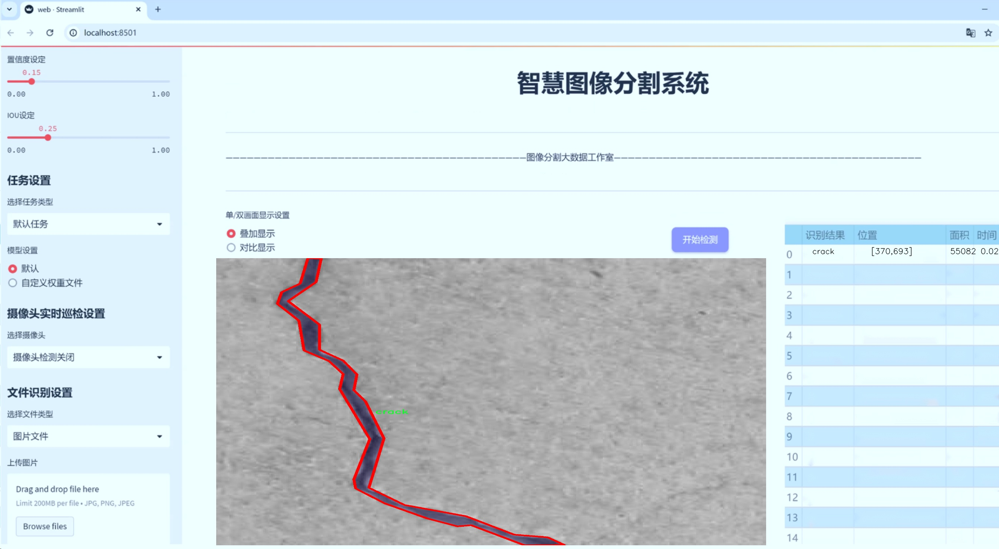
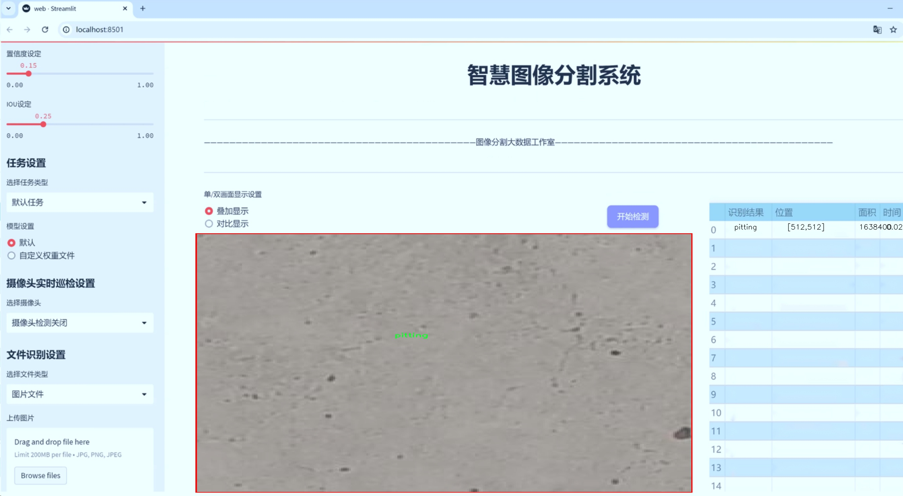
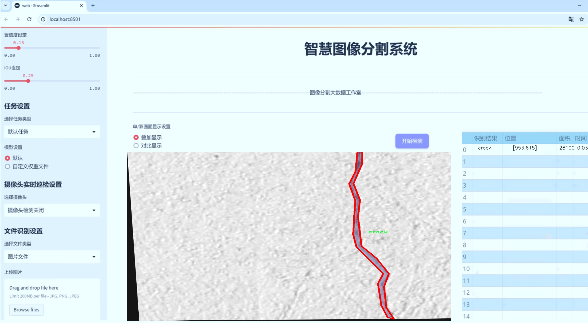
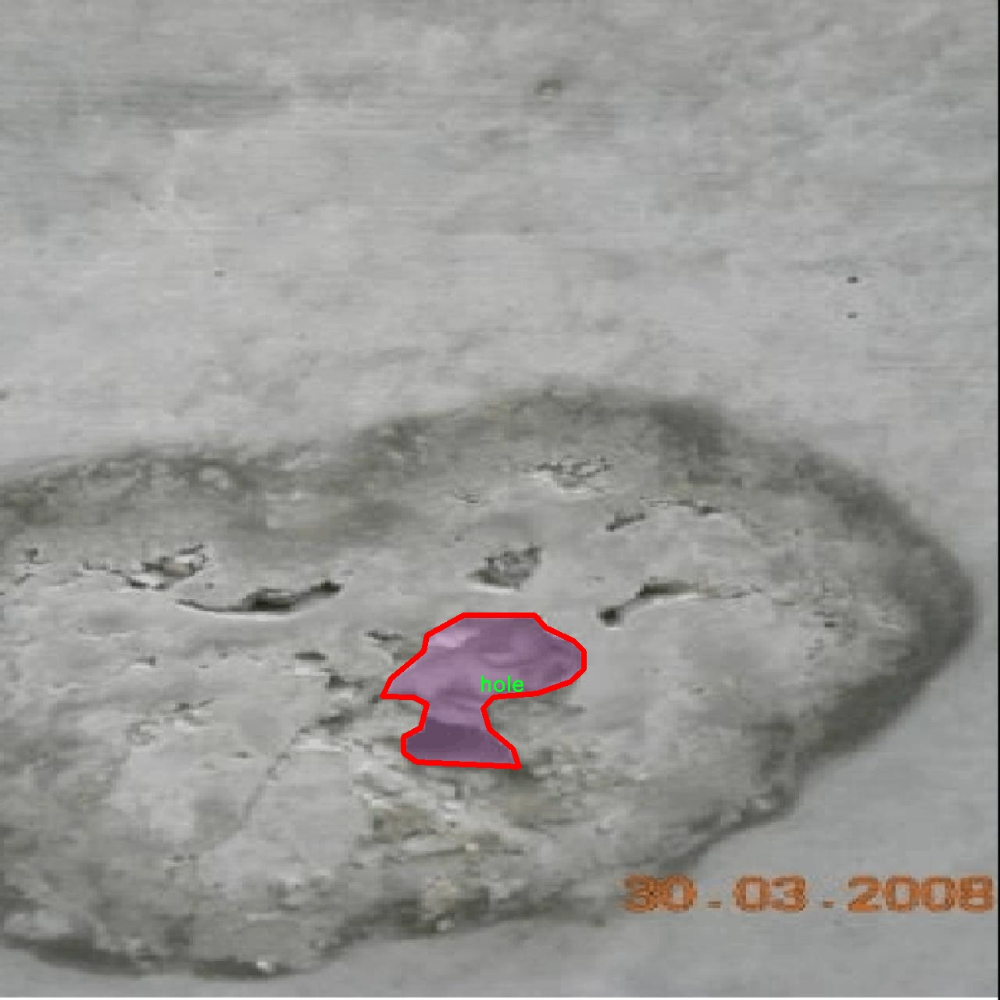
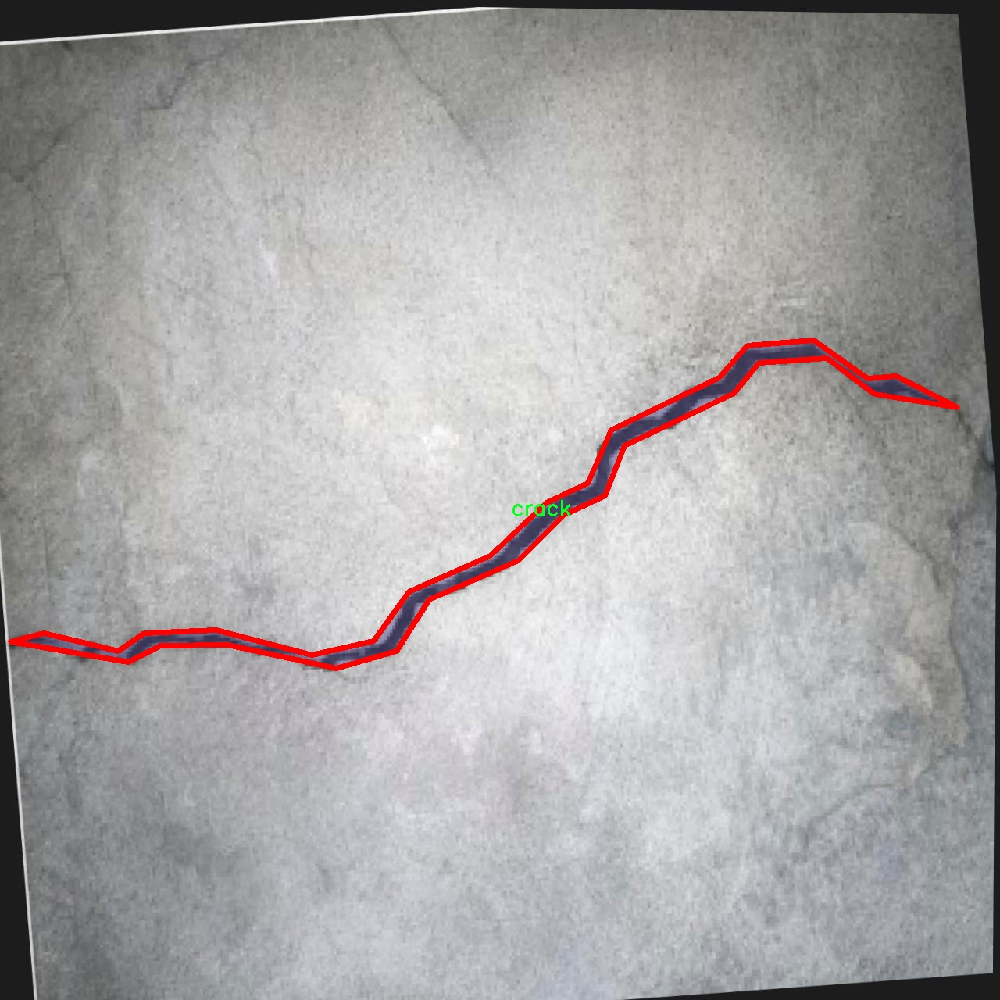
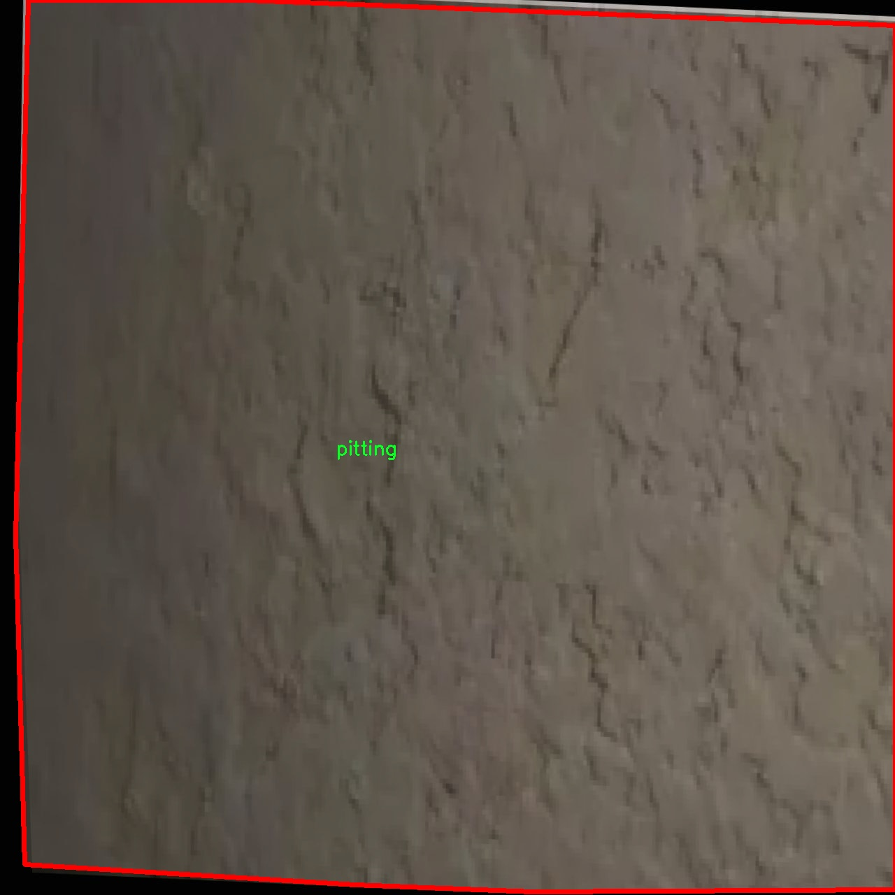
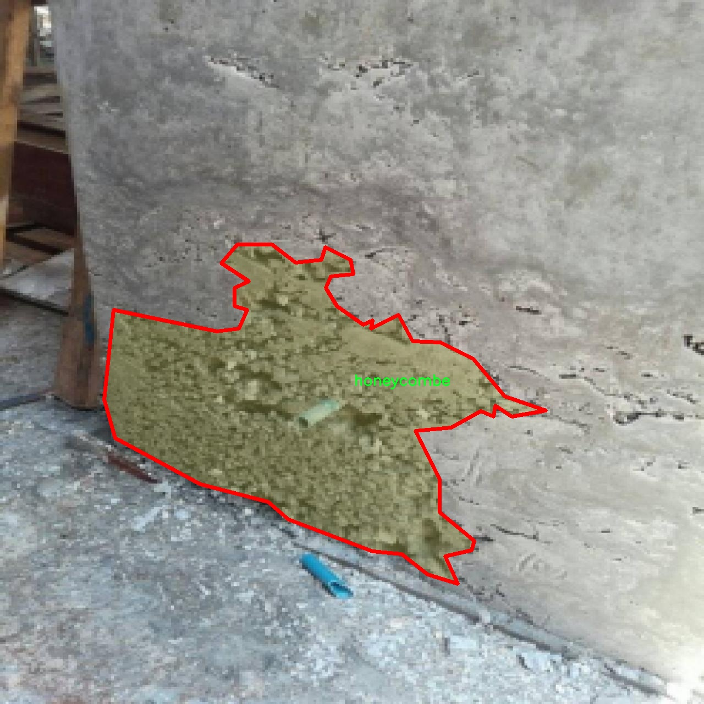
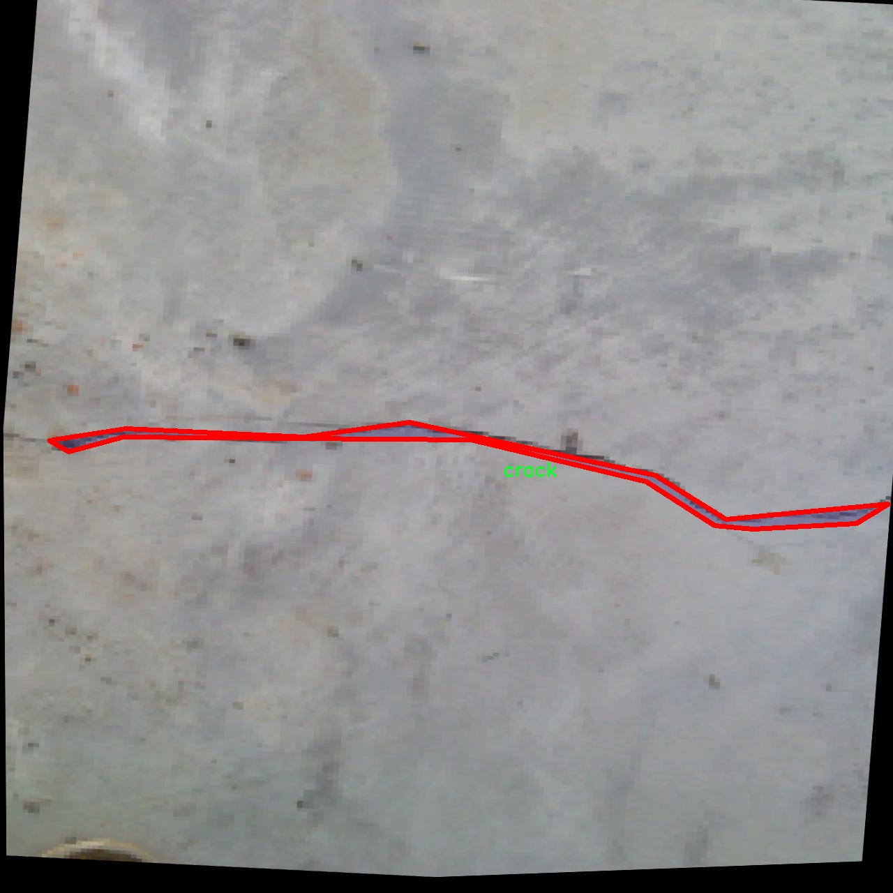

# 混凝土缺陷分割系统源码＆数据集分享
 [yolov8-seg-EfficientFormerV2＆yolov8-seg-C2f-DWR等50+全套改进创新点发刊_一键训练教程_Web前端展示]

### 1.研究背景与意义

项目参考[ILSVRC ImageNet Large Scale Visual Recognition Challenge](https://gitee.com/YOLOv8_YOLOv11_Segmentation_Studio/projects)

项目来源[AAAI Global Al lnnovation Contest](https://kdocs.cn/l/cszuIiCKVNis)

研究背景与意义

随着城市化进程的加快，混凝土作为建筑材料在基础设施建设中发挥着至关重要的作用。然而，混凝土结构在使用过程中常常会出现各种缺陷，如裂缝、孔洞、蜂窝、凹坑和剥落等，这些缺陷不仅影响建筑物的美观，更严重者可能导致结构的安全隐患。因此，及时、准确地检测和修复混凝土缺陷显得尤为重要。传统的混凝土缺陷检测方法主要依赖人工目测或简单的图像处理技术，这些方法不仅效率低下，而且容易受到人为因素的影响，导致检测结果的不准确性。

近年来，深度学习技术的迅猛发展为混凝土缺陷检测提供了新的解决方案。特别是基于卷积神经网络（CNN）的目标检测和分割技术，已经在多个领域取得了显著的成果。YOLO（You Only Look Once）系列模型以其高效的实时检测能力和较高的准确率，成为了目标检测领域的研究热点。YOLOv8作为该系列的最新版本，进一步提升了模型的性能和适用性，特别是在实例分割任务中展现出了优越的能力。

本研究旨在基于改进的YOLOv8模型，构建一个高效的混凝土缺陷分割系统。我们将利用一个包含1100张图像的数据集，该数据集涵盖了五类混凝土缺陷：裂缝、孔洞、蜂窝、凹坑和剥落。这些缺陷的多样性和复杂性为模型的训练和评估提供了丰富的样本，有助于提高模型的泛化能力和鲁棒性。通过对这些缺陷进行精确的实例分割，我们不仅能够实现对缺陷的自动检测，还能为后续的缺陷分析和修复提供数据支持。

此外，改进YOLOv8模型的研究意义在于探索如何通过优化网络结构和训练策略，提升模型在混凝土缺陷检测中的表现。我们将结合迁移学习、数据增强等技术，针对混凝土缺陷的特征进行模型的定制化调整，以期在保持高效性的同时，进一步提高检测的准确率和精度。这一研究不仅为混凝土缺陷检测提供了新的思路，也为相关领域的研究者提供了可借鉴的技术路径。

综上所述，基于改进YOLOv8的混凝土缺陷分割系统的研究具有重要的理论和实践意义。它不仅为混凝土结构的健康监测提供了高效的技术手段，也为智能建筑和基础设施的维护管理提供了数据支持，推动了建筑工程领域的智能化发展。通过本研究，我们希望能够为混凝土缺陷的早期发现和及时修复提供科学依据，保障建筑物的安全性和耐久性，最终实现可持续发展的目标。

### 2.图片演示







##### 注意：由于此博客编辑较早，上面“2.图片演示”和“3.视频演示”展示的系统图片或者视频可能为老版本，新版本在老版本的基础上升级如下：（实际效果以升级的新版本为准）

  （1）适配了YOLOV8的“目标检测”模型和“实例分割”模型，通过加载相应的权重（.pt）文件即可自适应加载模型。

  （2）支持“图片识别”、“视频识别”、“摄像头实时识别”三种识别模式。

  （3）支持“图片识别”、“视频识别”、“摄像头实时识别”三种识别结果保存导出，解决手动导出（容易卡顿出现爆内存）存在的问题，识别完自动保存结果并导出到tempDir中。

  （4）支持Web前端系统中的标题、背景图等自定义修改，后面提供修改教程。

  另外本项目提供训练的数据集和训练教程,暂不提供权重文件（best.pt）,需要您按照教程进行训练后实现图片演示和Web前端界面演示的效果。

### 3.视频演示

[3.1 视频演示](https://www.bilibili.com/video/BV1UiyKYUERn/)

### 4.数据集信息展示

##### 4.1 本项目数据集详细数据（类别数＆类别名）

nc: 5
names: ['crack', 'hole', 'honeycombe', 'pitting', 'spalling']


##### 4.2 本项目数据集信息介绍

数据集信息展示

在现代建筑和基础设施维护中，混凝土缺陷的及时检测与修复至关重要。为了提高混凝土缺陷的识别精度和效率，我们构建了一个专门用于训练改进YOLOv8-seg的混凝土缺陷分割系统的数据集，命名为“concrete”。该数据集旨在为研究人员和工程师提供一个高质量的基础，以便在实际应用中有效识别和分类各种混凝土缺陷。

“concrete”数据集包含五个主要类别，分别是裂缝（crack）、孔洞（hole）、蜂窝（honeycombe）、凹坑（pitting）和剥落（spalling）。这些类别涵盖了混凝土结构中常见的缺陷类型，每种缺陷都有其独特的特征和影响，直接关系到混凝土的结构完整性和使用寿命。通过对这些缺陷的准确分割和分类，工程师能够更好地评估混凝土的健康状况，从而制定相应的维护和修复策略。

在数据集的构建过程中，我们注重多样性和代表性，确保每个类别都包含了丰富的样本。这些样本不仅来源于不同的混凝土结构，还涵盖了各种环境条件下的缺陷表现。例如，裂缝可能因温度变化、湿度影响或荷载作用而产生，其形态和大小可能因具体情况而异；孔洞则可能是由于施工不当或材料问题引起的，表现为不同的深度和直径；蜂窝、凹坑和剥落等缺陷同样具有多样性，可能受到时间、环境和材料劣化等多种因素的影响。

为了确保数据集的高质量，我们在数据采集和标注过程中采用了严格的标准。每个样本都经过专业人员的仔细审查和标注，确保其准确性和一致性。此外，我们还利用先进的图像处理技术，对样本进行了预处理，以提高图像的清晰度和对比度，从而增强模型的训练效果。

在数据集的应用方面，“concrete”不仅可以用于训练改进YOLOv8-seg模型，还可以为其他深度学习模型提供基础数据支持。通过对混凝土缺陷的自动化检测与分割，研究人员可以进一步探索基于人工智能的智能监测系统，这将极大地提高混凝土结构的维护效率和安全性。

总之，“concrete”数据集为混凝土缺陷的研究与应用提供了坚实的基础，具有重要的学术价值和实际意义。通过不断优化和扩展该数据集，我们期望能够推动混凝土缺陷检测技术的发展，为建筑行业的可持续发展贡献力量。











### 5.全套项目环境部署视频教程（零基础手把手教学）

[5.1 环境部署教程链接（零基础手把手教学）](https://www.bilibili.com/video/BV1jG4Ve4E9t/?vd_source=bc9aec86d164b67a7004b996143742dc)


[5.2 安装Python虚拟环境创建和依赖库安装视频教程链接（零基础手把手教学）](https://www.bilibili.com/video/BV1nA4VeYEze/?vd_source=bc9aec86d164b67a7004b996143742dc)

### 6.手把手YOLOV8-seg训练视频教程（零基础小白有手就能学会）

[6.1 手把手YOLOV8-seg训练视频教程（零基础小白有手就能学会）](https://www.bilibili.com/video/BV1cA4VeYETe/?vd_source=bc9aec86d164b67a7004b996143742dc)


按照上面的训练视频教程链接加载项目提供的数据集，运行train.py即可开始训练



     Epoch   gpu_mem       box       obj       cls    labels  img_size
     1/200     0G   0.01576   0.01955  0.007536        22      1280: 100%|██████████| 849/849 [14:42<00:00,  1.04s/it]
               Class     Images     Labels          P          R     mAP@.5 mAP@.5:.95: 100%|██████████| 213/213 [01:14<00:00,  2.87it/s]
                 all       3395      17314      0.994      0.957      0.0957      0.0843

     Epoch   gpu_mem       box       obj       cls    labels  img_size
     2/200     0G   0.01578   0.01923  0.007006        22      1280: 100%|██████████| 849/849 [14:44<00:00,  1.04s/it]
               Class     Images     Labels          P          R     mAP@.5 mAP@.5:.95: 100%|██████████| 213/213 [01:12<00:00,  2.95it/s]
                 all       3395      17314      0.996      0.956      0.0957      0.0845

     Epoch   gpu_mem       box       obj       cls    labels  img_size
     3/200     0G   0.01561    0.0191  0.006895        27      1280: 100%|██████████| 849/849 [10:56<00:00,  1.29it/s]
               Class     Images     Labels          P          R     mAP@.5 mAP@.5:.95: 100%|███████   | 187/213 [00:52<00:00,  4.04it/s]
                 all       3395      17314      0.996      0.957      0.0957      0.0845


### 7.50+种全套YOLOV8-seg创新点代码加载调参视频教程（一键加载写好的改进模型的配置文件）

[7.1 50+种全套YOLOV8-seg创新点代码加载调参视频教程（一键加载写好的改进模型的配置文件）](https://www.bilibili.com/video/BV1Hw4VePEXv/?vd_source=bc9aec86d164b67a7004b996143742dc)

### 8.YOLOV8-seg图像分割算法原理

原始YOLOV8-seg算法原理

YOLO（You Only Look Once）系列算法自其诞生以来便在目标检测领域中引领潮流，随着技术的不断演进，YOLOv8-seg作为最新的版本，展现了其在多任务学习和实时处理能力上的显著优势。YOLOv8-seg不仅延续了YOLO系列的高效性和准确性，还在细粒度分割任务中引入了新的设计理念和结构，特别是在处理复杂场景时的表现尤为突出。

YOLOv8-seg的网络结构主要分为三个部分：输入端（Input）、主干网络（Backbone）和检测端（Head）。在这三个部分中，主干网络是特征提取的核心，负责从输入图像中提取出有用的特征信息。YOLOv8-seg采用了C2f模块替代了YOLOv5中的C3模块，这一创新设计不仅提高了特征提取的效率，还增强了模型的表达能力。C2f模块通过引入更多的残差连接，确保了在轻量化的基础上，模型能够获得更加丰富的梯度信息，从而在训练过程中更好地捕捉到图像中的细节特征。

在YOLOv8-seg的主干网络中，采用了CSP（Cross Stage Partial）结构，将特征提取过程分为卷积和连接两个部分。这种设计使得网络在保持较小参数量的同时，依然能够实现高效的特征提取。此外，YOLOv8-seg还引入了快速空间金字塔池化（SPPF）模块，以提升模型的计算速度，进一步增强了实时处理能力。这一系列的设计使得YOLOv8-seg在处理多尺度目标时，能够更好地融合来自不同层次的特征信息，从而提高目标检测的性能和鲁棒性。

在特征融合方面，YOLOv8-seg采用了PAN-FPN（Path Aggregation Network - Feature Pyramid Network）结构。这一结构通过多尺度特征融合技术，将来自主干网络不同阶段的特征图进行有效结合，确保了模型能够在不同尺度下捕捉到目标信息。这种特征融合策略不仅提升了模型对小目标的检测能力，还增强了对复杂背景的适应性，使得YOLOv8-seg在各种应用场景中表现出色。

YOLOv8-seg的检测端采用了解耦合头结构，将分类和检测任务分离，极大地提高了模型的灵活性和可扩展性。传统的目标检测方法通常依赖于Anchor-Based策略，而YOLOv8-seg则创新性地引入了Anchor-Free的检测方式，这一转变不仅简化了模型的设计，还减少了对超参数的依赖，使得模型在不同任务和数据集上的适应性更强。

在训练过程中，YOLOv8-seg引入了动态Task-Aligned Assigner样本分配策略，这一策略能够根据任务的不同阶段动态调整样本的分配方式，从而优化训练效果。此外，在数据增强方面，YOLOv8-seg借鉴了YOLOv5中的经验，在训练的最后10个epoch中关闭马赛克增强，以确保模型在训练后期能够更加专注于目标检测的精度提升。

在损失函数的设计上，YOLOv8-seg采用了BCELoss作为分类损失，同时结合DFLLoss和CIoULoss作为回归损失。这种多重损失函数的设计，使得模型在优化过程中能够更好地平衡分类和回归任务的性能，从而提升整体的检测精度。

YOLOv8-seg的设计理念和结构创新，使其在目标检测和分割任务中都表现出了卓越的性能。无论是在处理复杂场景、提高检测精度，还是在实时性和计算效率方面，YOLOv8-seg都展现了其强大的能力。通过对YOLOv8-seg算法原理的深入分析，我们可以看到其在目标检测领域的潜力和广泛应用前景。随着YOLOv8-seg的不断发展和优化，未来的目标检测技术将会更加高效、准确，推动计算机视觉领域的进一步进步。


### 9.系统功能展示（检测对象为举例，实际内容以本项目数据集为准）

图9.1.系统支持检测结果表格显示

  图9.2.系统支持置信度和IOU阈值手动调节

  图9.3.系统支持自定义加载权重文件best.pt(需要你通过步骤5中训练获得)

  图9.4.系统支持摄像头实时识别

  图9.5.系统支持图片识别

  图9.6.系统支持视频识别

  图9.7.系统支持识别结果文件自动保存

  图9.8.系统支持Excel导出检测结果数据


### 10.50+种全套YOLOV8-seg创新点原理讲解（非科班也可以轻松写刊发刊，V11版本正在科研待更新）

#### 10.1 由于篇幅限制，每个创新点的具体原理讲解就不一一展开，具体见下列网址中的创新点对应子项目的技术原理博客网址【Blog】：


[10.1 50+种全套YOLOV8-seg创新点原理讲解链接](https://gitee.com/qunmasj/good)

#### 10.2 部分改进模块原理讲解(完整的改进原理见上图和技术博客链接)【如果此小节的图加载失败可以通过CSDN或者Github搜索该博客的标题访问原始博客，原始博客图片显示正常】
### YOLOv8简介
在各种目标检测算法中，YOLO系列因其速度和准确度间的优异平衡脱颖而出，能够准确、快速的识别目标，便于部署到各种移动设备中，已经广泛应用于各种领域的目标检测、跟踪和分割。目前最新版本 YOLOv8由原v5的开发团队Ultralytics于2023年1月提出，按规格大小可划分为n、s、m、1和x5个版本，是目前最先进的目标检测算法，有着优异的性能，很适合用于无人机航拍图像目标检测。其网络结构如图所示。

YOLOv8模型包括Input、Backbone、Neck 和Head4部分。其中 Input选用了Mosaic数据增强方法，并且对于不同大小的模型，有部分超参数会进行修改，典型的如大模型会开启 MixUp 和CopyPaste数据增强，能够丰富数据集，提升模型的泛化能力和鲁棒性。Backbone主要用于提取图片中的信息，提供给Neck和Head使用，由多个Conv、C2f模块和尾部的SPPF组成。Conv模块由单个Conv2d、
BatchNorm2d和激活函数构成,用丁是双行在万E5特征图;YOLOv8参考了C3模块的残左绒以心YOLOv7[16l的ELAN思想，设计出了C2f 结构，可以在保证轻量化的同时获得更加丰富的梯度流信息，并根据模型尺度来调整通道数，大幅提升了模型性能;SPPF是空间金字塔池化，能够融合不同尺度的特征。Neck部分主要起特征融合的作用，充分利用了骨干网络提取的特征，采用FPN[17]+PAN[18〕结构，
能够增强多个尺度上的语义表达和定位能力。Head输出端根据前两部分处理得到的特征来获取检测目标的类别和位置信息，做出识别,换以小旦公来和定解耦头结构,将分类和检测头分:9w‘无锅框的位关注侧重点不同的问题，同时也采用了无锚框的目标检测（Anchor-Free)，能够提升检测速度。Loss计算方面采用了正负样本动态分配策略，使用 VFLLoss 作为分类损失，使用DFLLoss+CIOU Loss作为回归损失。

### AutoFocus: Efficient Multi-Scale Conv简介

参考该博客提出了AutoFocus，一种高效的多尺度目标检测算法。相较于以前对整个图像金字塔进行处理，该方法以一种由表及里的姿态，仅处理哪些整体上看来很有可能存在小物体的区域。这个可以通过预测一张类别未知的分割图FocusPixels来得到。为了高效利用FocusPixels，另外一个算法用于产生包含FocusPixels的FocusChips，这样可以减少计算量并处理更更精细的尺度。在不同尺度上FocusChips所得到的检测结果综合时，会出现问题，我们也提供了解决问题的方案。AutoFocus在COCO上的结果有49.7%mAP（50%重叠下68.3%），与多尺度baseline相仿但是快了2.5倍。金字塔中处理的像素数量减少了5倍mAP只下降1%，在与RetinaNet采用相同的ResNet-101结构且速度相同时，高了10%mAP。

人类寻找物体是一个动态的过程，且寻找时间与场景的复杂度是直接相关的。当我们的眼神在不同的点之间漂移时，其他的区域会被我们有意忽视。然而，现在的检测算法是一种静态的推理过程且图像金字塔中的每个像素都受到了一样的对待，这使得过程变得没有效率。现在许多的应用都不强调实时性，而计算上的节省其实可以产生很大收益。

在COCO数据集中，虽然40%的物体都是小物体，但是它们一共只占了全图的0.3%。如果金字塔是3倍关系，则在高分辨率层要进行9倍的运算。XXX 。那么有没有办法在低分辨率下找出可能含有这些物体的区域呢？

以人眼方案类比，我们可以从低分辨率图像开始，找出有可能存在物体的区域再“聚集”到高分辨率。我们的AutoFocus会在一层中计算小物体的分割图FocusPixels，而在每一个FocusPixels上会用一个算法产生下一层所需要关注的chips。在COCO的最大分辨率层上我们可以只处理**20%的像素而性能不下降，如果只处理5%**也只下降1%而已。


图像金字塔与卷积神经网络对CV十分重要。然而卷积神经网络无法做到对尺度不敏感，所以为了不同大小的物体需要依赖图像金字塔。虽然训练已经有了高效的方法，但是其推断时间依然远离实际使用标准。

目标检测加速有很长历史了。常用的有特征近似以减少尺度、级联、特征金字塔，且最后一个最近很多人研究。

AutoFocus为速度与精度之间提供了一个平滑的折衷，指出可以在低分辨率下看出小物体的所在，从而节约计算。FocusPixels的计算较为容易。

先简单介绍一下SNIP，是一种多尺度的训练、推断算法。主要思想是训练针对某个特定scale的检测器而不是scale-invariant检测器。这样训练样本就局限于在某个尺度范围内，以适于这个检测器处理。比如在高分辨率仅处理小物体而高分辨率仅处理大物体，其优势在于训练时不用考虑尺度的变化。

由于训练时物体大小是已知的，我们在图像金字塔中可以忽略大量区域而只处理物体周围的区域。SNIPER说明这样低分辨率的训练与全图训练相比并不会降低性能。同样，在推断过程中如果可以在大分辨率图像上预测可能出现小物体的chip，我们也就不用处理整张高分辨率图片。在训练时，许多物体会被裁剪、扭曲，这可以当作是一种数据扩增，然而当这个情况在推断时出现，则会产生错误，所以我们还需要一个算法来整合不同尺度上的检测结果。

#### AutoFocus框架
如SIFT、SURF等传统分类特征包含两个组件，一个detector和一个descriptor。detector只包含轻量级的操作如DoG、LoG，用于在整张图片上找到感兴趣的区域；descriptor，一般来说计算量比较大，则只需要关注那些咸兴趣的区域。这个级联结构保障了图片处理的效率。

同样，AutoFocus框架也是用于预测感兴趣的区域，并丢弃在下一尺度不可能存在物体的区域，并将裁剪和缩放后的区域传递给下一尺度。AutoFocus由三个部分组成：FocusPixels，FocusChips和focus stacking。

#### FocusPixels
FocusPixels定义在卷积网络特征图的粒度之上（如conv5），如果特征图上某个像素与小物体有重叠则标注为一个FocusPixel。（小物体：面积处于一个网络的输入范围之内）。训练过程中，FocusPixels标注为正，某些与不在面积范围内的物体有重叠的像素标注为无效，其他像素标注为负。AutoFocus的训练目标是使在FocusPixels区域产生较大的激活值。

如果同时多个物体与同一像素重叠，优先给正标注。我们的网络输入是512x512，然后a,b,c取值分别是5,64,90。对于太大或太小的物体，我们认为当前尺度上没有足够人信息进行判断，所以会标定为无效。整个网络结构如下图。训练时加两层带ReLU的卷积(3x3和1x1)以及一个二分类softmax来预测FocusPixels。


#### FocusChip生成
推断过程中，我们标注输出概率大于阈值t的像素（这个参数可以控制加速比），得到一些连通域。对于每一个域，我们做一次膨胀使其包含一些有助于识别的周围信息，膨胀后相连的部分要合并。然后，我们生成一些包含连通域的chips（不同chips可能重叠，如有重叠则合并）。有些chip可能太小缺少必要信息，并使chip的大小变化很大，为了效率我们要求保证一个最小的chip size。算法流程如下：


#### 级联推断过程
我们的过程类似于图片金字塔的推断过程但是在过程中一步步去除不关注的图片区域。我们在最低分辨率上进行检测并生成chips，然后在这些chips再进行检测和生成chips。

#### Focus Stacking
这种级联分类器的一个问题是在chip边缘本来的大物体可能生成一些被剪裁的检测目标。在下一个尺度上，由于剪裁过了，所以会检测到小的、错误的正例False Positive。之前算法中的第二步膨胀其实就是为了保证没有物体会出现在chip的边缘。这样，当我们在局部图片chip的边缘检测到物体时，就可以把这个检测结果丢弃，即使其在SNIP的范围内。

也有一些物体在图片边缘的特殊情况。如果chip和图片共享一条边的话，我们会检查检测结果的其他边是否完全在里面，如果在，则保留它，否则丢弃。

在每一尺度得到有效检测结果后，我们可以将不同尺度上的结果进行整合，将这些结果映射到原图坐标系上。最后，非极大值抑制NMS用于聚集。网络结构如之前的图片所示。


### 11.项目核心源码讲解（再也不用担心看不懂代码逻辑）

#### 11.1 ui.py

以下是经过简化和注释的核心代码：

```python
import sys
import subprocess

def run_script(script_path):
    """
    使用当前 Python 环境运行指定的脚本。

    Args:
        script_path (str): 要运行的脚本路径
    """
    # 获取当前 Python 解释器的路径
    python_path = sys.executable

    # 构建运行命令，使用 streamlit 运行指定的脚本
    command = f'"{python_path}" -m streamlit run "{script_path}"'

    # 执行命令并等待其完成
    result = subprocess.run(command, shell=True)
    
    # 检查命令执行的返回码，如果不为0则表示出错
    if result.returncode != 0:
        print("脚本运行出错。")

# 程序入口
if __name__ == "__main__":
    # 指定要运行的脚本路径
    script_path = "web.py"  # 这里可以直接指定脚本名称

    # 调用函数运行脚本
    run_script(script_path)
```

### 代码说明：
1. **导入模块**：
   - `sys`：用于获取当前 Python 解释器的路径。
   - `subprocess`：用于执行外部命令。

2. **`run_script` 函数**：
   - 接受一个参数 `script_path`，表示要运行的 Python 脚本的路径。
   - 使用 `sys.executable` 获取当前 Python 解释器的路径。
   - 构建一个命令字符串，用于通过 `streamlit` 运行指定的脚本。
   - 使用 `subprocess.run` 执行命令，并等待其完成。
   - 检查命令的返回码，如果返回码不为0，表示脚本运行出错，打印错误信息。

3. **程序入口**：
   - 在 `__main__` 块中，指定要运行的脚本路径（这里直接使用 `"web.py"`）。
   - 调用 `run_script` 函数来执行该脚本。

这个程序文件 `ui.py` 的主要功能是通过当前的 Python 环境来运行一个指定的脚本，具体是使用 Streamlit 来启动一个 Web 应用。程序首先导入了必要的模块，包括 `sys`、`os` 和 `subprocess`，以及一个自定义的 `abs_path` 函数，用于获取脚本的绝对路径。

在 `run_script` 函数中，首先获取当前 Python 解释器的路径，这样可以确保在正确的环境中运行脚本。接着，构建了一个命令字符串，这个命令使用了 Python 的 `-m` 选项来运行 Streamlit，并指定了要运行的脚本路径。然后，使用 `subprocess.run` 方法来执行这个命令。该方法的 `shell=True` 参数允许在 shell 中执行命令。如果脚本运行返回的状态码不为零，表示执行过程中出现了错误，程序会打印出“脚本运行出错”的提示。

在文件的最后部分，使用 `if __name__ == "__main__":` 语句来确保只有在直接运行该文件时才会执行后面的代码。这里指定了要运行的脚本路径为 `web.py`，并调用 `run_script` 函数来启动这个脚本。

总体来说，这个文件的功能是将一个名为 `web.py` 的脚本通过 Streamlit 运行起来，提供了一个简单的界面来启动 Web 应用。

#### 11.2 demo_test_video.py

以下是经过简化和注释的核心代码部分：

```python
import cv2
import numpy as np
from PIL import ImageFont, ImageDraw, Image
from hashlib import md5
from model import Web_Detector
from chinese_name_list import Label_list

def generate_color_based_on_name(name):
    # 使用MD5哈希函数生成稳定的颜色
    hash_object = md5(name.encode())
    hex_color = hash_object.hexdigest()[:6]  # 取前6位16进制数
    r, g, b = int(hex_color[0:2], 16), int(hex_color[2:4], 16), int(hex_color[4:6], 16)
    return (b, g, r)  # OpenCV使用BGR格式

def draw_with_chinese(image, text, position, font_size=20, color=(255, 0, 0)):
    # 在图像上绘制中文文本
    image_pil = Image.fromarray(cv2.cvtColor(image, cv2.COLOR_BGR2RGB))  # 转换为PIL格式
    draw = ImageDraw.Draw(image_pil)  # 创建绘图对象
    font = ImageFont.truetype("simsun.ttc", font_size, encoding="unic")  # 加载中文字体
    draw.text(position, text, font=font, fill=color)  # 绘制文本
    return cv2.cvtColor(np.array(image_pil), cv2.COLOR_RGB2BGR)  # 转换回OpenCV格式

def draw_detections(image, info):
    # 绘制检测结果，包括边框、类别名称等
    name, bbox = info['class_name'], info['bbox']  # 获取类别名称和边界框
    x1, y1, x2, y2 = bbox  # 解包边界框坐标
    cv2.rectangle(image, (x1, y1), (x2, y2), color=(0, 0, 255), thickness=3)  # 绘制边框
    image = draw_with_chinese(image, name, (x1, y1 - 10), font_size=20)  # 绘制类别名称
    return image

def process_frame(model, image):
    # 处理每一帧图像，进行目标检测
    pre_img = model.preprocess(image)  # 预处理图像
    pred = model.predict(pre_img)  # 进行预测
    det = pred[0]  # 获取检测结果

    if det is not None and len(det):
        det_info = model.postprocess(pred)  # 后处理，获取检测信息
        for info in det_info:
            image = draw_detections(image, info)  # 绘制检测结果
    return image

if __name__ == "__main__":
    model = Web_Detector()  # 初始化模型
    model.load_model("./weights/yolov8s-seg.pt")  # 加载模型权重

    # 视频处理
    video_path = ''  # 输入视频路径
    cap = cv2.VideoCapture(video_path)  # 打开视频文件
    while cap.isOpened():
        ret, frame = cap.read()  # 逐帧读取视频
        if not ret:
            break
        processed_frame = process_frame(model, frame)  # 处理当前帧
        cv2.imshow('Processed Video', processed_frame)  # 显示处理后的帧
        if cv2.waitKey(1) & 0xFF == ord('q'):
            break  # 按'q'键退出
    cap.release()  # 释放视频捕获对象
    cv2.destroyAllWindows()  # 关闭所有OpenCV窗口
```

### 代码说明：
1. **generate_color_based_on_name**: 通过对类别名称进行MD5哈希，生成一个稳定的颜色值，返回BGR格式的颜色。
2. **draw_with_chinese**: 在图像上绘制中文文本，使用PIL库处理中文字体。
3. **draw_detections**: 根据检测信息绘制边界框和类别名称。
4. **process_frame**: 处理每一帧图像，进行目标检测并绘制结果。
5. **主程序**: 初始化模型，加载权重，逐帧读取视频并处理，显示处理后的结果。

这个程序文件`demo_test_video.py`主要用于处理视频流，利用深度学习模型进行目标检测和分割，并在视频帧上绘制检测结果。程序首先导入了一些必要的库，包括`random`、`cv2`（OpenCV）、`numpy`、`PIL`（用于图像处理）、`hashlib`（用于生成哈希值）以及自定义的`Web_Detector`模型和`Label_list`。

程序中定义了几个函数。`generate_color_based_on_name`函数根据输入的名称生成一个稳定的颜色，使用MD5哈希函数确保同一名称总是生成相同的颜色，返回值为BGR格式的颜色元组。`calculate_polygon_area`函数用于计算多边形的面积，利用OpenCV的`contourArea`函数。

`draw_with_chinese`函数负责在图像上绘制中文文本，使用PIL库将OpenCV图像转换为PIL格式，绘制文本后再转换回OpenCV格式。`adjust_parameter`函数根据图像的大小调整参数，以确保绘制的内容在不同大小的图像上保持一致。

`draw_detections`函数是核心部分，负责在图像上绘制检测到的目标。它首先根据输入的信息提取目标的名称、边界框、置信度、类别ID和掩码。如果没有掩码，则绘制边界框并标注名称；如果有掩码，则计算多边形的面积、周长和圆度，并绘制相应的掩码和信息，包括颜色值等。

`process_frame`函数用于处理每一帧图像，首先对图像进行预处理，然后通过模型进行预测，最后将检测到的目标信息传递给`draw_detections`函数进行绘制。

在主程序部分，首先加载模型并指定视频路径。通过OpenCV读取视频帧，逐帧处理，调用`process_frame`函数进行目标检测和绘制，最后显示处理后的结果。如果按下‘q’键，则退出循环并释放视频资源，关闭所有OpenCV窗口。

整体来看，这个程序实现了一个实时视频处理的功能，通过深度学习模型检测视频中的目标，并在每一帧上绘制出相应的检测结果和信息。

#### 11.3 ultralytics\models\yolo\pose\predict.py

以下是经过简化和注释的核心代码部分：

```python
# 导入必要的模块和类
from ultralytics.engine.results import Results
from ultralytics.models.yolo.detect.predict import DetectionPredictor
from ultralytics.utils import DEFAULT_CFG, LOGGER, ops

class PosePredictor(DetectionPredictor):
    """
    PosePredictor类，继承自DetectionPredictor，用于基于姿态模型进行预测。
    """

    def __init__(self, cfg=DEFAULT_CFG, overrides=None, _callbacks=None):
        """初始化PosePredictor，设置任务为'pose'并记录关于使用'mps'作为设备的警告。"""
        super().__init__(cfg, overrides, _callbacks)  # 调用父类构造函数
        self.args.task = 'pose'  # 设置任务类型为姿态检测
        # 检查设备类型，如果是'mps'，则发出警告
        if isinstance(self.args.device, str) and self.args.device.lower() == 'mps':
            LOGGER.warning("WARNING ⚠️ Apple MPS known Pose bug. Recommend 'device=cpu' for Pose models. "
                           'See https://github.com/ultralytics/ultralytics/issues/4031.')

    def postprocess(self, preds, img, orig_imgs):
        """对给定输入图像或图像列表返回检测结果。"""
        # 应用非极大值抑制，过滤掉重叠的检测框
        preds = ops.non_max_suppression(preds,
                                        self.args.conf,  # 置信度阈值
                                        self.args.iou,   # IOU阈值
                                        agnostic=self.args.agnostic_nms,  # 是否类别无关
                                        max_det=self.args.max_det,  # 最大检测数量
                                        classes=self.args.classes,  # 过滤的类别
                                        nc=len(self.model.names))  # 类别数量

        # 如果输入图像不是列表，则将其转换为numpy数组
        if not isinstance(orig_imgs, list):
            orig_imgs = ops.convert_torch2numpy_batch(orig_imgs)

        results = []  # 存储结果的列表
        for i, pred in enumerate(preds):  # 遍历每个预测结果
            orig_img = orig_imgs[i]  # 获取原始图像
            # 将预测框的坐标缩放到原始图像的尺寸
            pred[:, :4] = ops.scale_boxes(img.shape[2:], pred[:, :4], orig_img.shape).round()
            # 获取关键点预测并缩放
            pred_kpts = pred[:, 6:].view(len(pred), *self.model.kpt_shape) if len(pred) else pred[:, 6:]
            pred_kpts = ops.scale_coords(img.shape[2:], pred_kpts, orig_img.shape)
            img_path = self.batch[0][i]  # 获取图像路径
            # 将结果存储到Results对象中
            results.append(
                Results(orig_img, path=img_path, names=self.model.names, boxes=pred[:, :6], keypoints=pred_kpts))
        return results  # 返回所有结果
```

### 代码注释说明：
1. **导入模块**：引入了处理结果和预测的必要类和函数。
2. **PosePredictor类**：这是一个用于姿态检测的预测器，继承自检测预测器。
3. **构造函数**：初始化时设置任务类型为姿态检测，并检查设备类型，发出警告。
4. **后处理函数**：对模型的预测结果进行后处理，包括非极大值抑制、坐标缩放等，最终返回处理后的结果。

这个程序文件是Ultralytics YOLO模型中的一个用于姿态预测的类，文件名为`predict.py`。它继承自`DetectionPredictor`类，专门用于处理与姿态估计相关的预测任务。

在文件的开头，首先导入了一些必要的模块和类，包括`Results`、`DetectionPredictor`和一些工具函数。接着定义了`PosePredictor`类，该类的主要功能是进行姿态预测。

`PosePredictor`类的构造函数`__init__`中，调用了父类的构造函数，并将任务类型设置为'pose'。此外，如果设备类型被设置为'MPS'（即Apple的Metal Performance Shaders），则会发出警告，提示用户可能会遇到已知的姿态模型问题，建议使用'cpu'作为设备。

`postprocess`方法用于处理预测结果。它接收预测结果、输入图像和原始图像作为参数。首先，使用非极大值抑制（NMS）来过滤预测结果，以减少重叠的检测框。接着，如果输入的原始图像不是列表格式，则将其转换为NumPy数组格式。

在处理每个预测结果时，方法会对预测框进行缩放，以适应原始图像的尺寸。同时，提取关键点并进行相应的缩放。最后，将处理后的结果存储在`Results`对象中，并返回这些结果。

整体来看，这个文件的主要功能是扩展YOLO模型的检测能力，使其能够进行姿态估计，并对预测结果进行后处理，以便于后续的分析和应用。

#### 11.4 train.py

以下是代码中最核心的部分，并附上详细的中文注释：

```python
import os
import torch
import yaml
from ultralytics import YOLO  # 导入YOLO模型库

if __name__ == '__main__':  # 确保该模块被直接运行时才执行以下代码
    # 设置训练参数
    workers = 1  # 数据加载的工作进程数
    batch = 8  # 每个批次的样本数量
    device = "0" if torch.cuda.is_available() else "cpu"  # 检查是否有可用的GPU，选择设备

    # 获取数据集配置文件的绝对路径
    data_path = abs_path(f'datasets/data/data.yaml', path_type='current')

    # 将路径格式转换为Unix风格
    unix_style_path = data_path.replace(os.sep, '/')
    # 获取数据集所在目录的路径
    directory_path = os.path.dirname(unix_style_path)

    # 读取YAML格式的数据集配置文件
    with open(data_path, 'r') as file:
        data = yaml.load(file, Loader=yaml.FullLoader)

    # 修改数据集路径
    if 'train' in data and 'val' in data and 'test' in data:
        data['train'] = directory_path + '/train'  # 设置训练集路径
        data['val'] = directory_path + '/val'      # 设置验证集路径
        data['test'] = directory_path + '/test'    # 设置测试集路径

        # 将修改后的数据写回YAML文件
        with open(data_path, 'w') as file:
            yaml.safe_dump(data, file, sort_keys=False)

    # 加载YOLO模型配置文件和预训练权重
    model = YOLO(r"C:\codeseg\codenew\50+种YOLOv8算法改进源码大全和调试加载训练教程（非必要）\改进YOLOv8模型配置文件\yolov8-seg-C2f-Faster.yaml").load("./weights/yolov8s-seg.pt")

    # 开始训练模型
    results = model.train(
        data=data_path,  # 指定训练数据的配置文件路径
        device=device,  # 指定使用的设备（GPU或CPU）
        workers=workers,  # 指定数据加载的工作进程数
        imgsz=640,  # 指定输入图像的大小为640x640
        epochs=100,  # 指定训练的轮数为100
        batch=batch,  # 指定每个批次的大小
    )
```

### 代码注释说明：
1. **导入必要的库**：引入了处理文件路径、深度学习框架（PyTorch）、YAML文件解析库和YOLO模型库。
2. **主程序入口**：使用`if __name__ == '__main__':`确保只有在直接运行该脚本时才执行后续代码。
3. **设置训练参数**：定义了数据加载的工作进程数、批次大小和设备选择（GPU或CPU）。
4. **获取数据集配置文件路径**：使用`abs_path`函数获取数据集配置文件的绝对路径，并转换为Unix风格路径。
5. **读取和修改YAML文件**：读取数据集配置文件，修改训练、验证和测试集的路径，并将修改后的内容写回文件。
6. **加载YOLO模型**：指定模型的配置文件和预训练权重，加载YOLO模型。
7. **开始训练模型**：调用`model.train`方法进行模型训练，传入数据路径、设备、工作进程数、图像大小、训练轮数和批次大小等参数。

该程序文件 `train.py` 是一个用于训练 YOLO（You Only Look Once）模型的脚本。首先，它导入了必要的库，包括操作系统相关的 `os`、深度学习框架 `torch`、YAML 文件处理库 `yaml` 以及 YOLO 模型的实现。程序还使用了 `matplotlib` 来设置图形显示的后端。

在主程序部分，首先设置了一些训练参数，包括工作进程数 `workers` 和批次大小 `batch`。批次大小可以根据计算机的显存和内存进行调整，如果显存不足，可以适当降低该值。接着，程序判断是否可以使用 GPU，如果可以，则将设备设置为 "0"（表示使用第一个 GPU），否则使用 CPU。

程序接下来获取数据集配置文件的绝对路径，该配置文件是一个 YAML 文件，包含了训练、验证和测试数据的路径。通过将操作系统特定的路径分隔符替换为 UNIX 风格的分隔符，程序获取了数据集的目录路径。然后，程序打开 YAML 文件并读取其内容。若文件中包含 'train'、'val' 和 'test' 项，程序将这些项的路径修改为相对于数据集目录的路径，并将修改后的内容写回 YAML 文件。

接下来，程序加载一个 YOLO 模型的配置文件，并使用预训练的权重文件进行初始化。模型的选择可以根据不同的需求进行调整，程序中提到了一些其他模型的配置文件供用户选择。

最后，程序调用模型的 `train` 方法开始训练，传入了训练数据的配置文件路径、设备、工作进程数、输入图像大小、训练的 epoch 数量以及批次大小等参数。训练过程将使用这些参数进行模型的训练。

#### 11.5 ultralytics\models\utils\loss.py

以下是经过简化和注释的核心代码部分，主要集中在损失计算的逻辑上：

```python
import torch
import torch.nn as nn
import torch.nn.functional as F
from ultralytics.utils.metrics import bbox_iou
from .ops import HungarianMatcher

class DETRLoss(nn.Module):
    """
    DETR (DEtection TRansformer) 损失类。该类计算并返回DETR目标检测模型的不同损失组件。
    包括分类损失、边界框损失、GIoU损失等。
    """

    def __init__(self, nc=80, loss_gain=None, aux_loss=True, use_fl=True, use_vfl=False):
        """
        初始化DETR损失函数。

        Args:
            nc (int): 类别数量。
            loss_gain (dict): 各种损失组件的系数。
            aux_loss (bool): 是否计算辅助损失。
            use_fl (bool): 是否使用FocalLoss。
            use_vfl (bool): 是否使用VarifocalLoss。
        """
        super().__init__()
        if loss_gain is None:
            loss_gain = {'class': 1, 'bbox': 5, 'giou': 2}
        self.nc = nc  # 类别数量
        self.matcher = HungarianMatcher(cost_gain={'class': 2, 'bbox': 5, 'giou': 2})  # 匹配器
        self.loss_gain = loss_gain  # 损失系数
        self.aux_loss = aux_loss  # 是否使用辅助损失
        self.fl = FocalLoss() if use_fl else None  # Focal Loss对象
        self.vfl = VarifocalLoss() if use_vfl else None  # Varifocal Loss对象
        self.device = None  # 设备

    def _get_loss_class(self, pred_scores, targets, gt_scores, num_gts):
        """计算分类损失。"""
        bs, nq = pred_scores.shape[:2]  # 获取批次大小和查询数量
        one_hot = torch.zeros((bs, nq, self.nc + 1), dtype=torch.int64, device=targets.device)
        one_hot.scatter_(2, targets.unsqueeze(-1), 1)  # 生成one-hot编码
        one_hot = one_hot[..., :-1]  # 去掉最后一类（背景类）
        gt_scores = gt_scores.view(bs, nq, 1) * one_hot  # 计算目标分数

        # 使用Focal Loss或Varifocal Loss计算损失
        if self.fl:
            if num_gts and self.vfl:
                loss_cls = self.vfl(pred_scores, gt_scores, one_hot)
            else:
                loss_cls = self.fl(pred_scores, one_hot.float())
            loss_cls /= max(num_gts, 1) / nq  # 归一化损失
        else:
            loss_cls = nn.BCEWithLogitsLoss(reduction='none')(pred_scores, gt_scores).mean(1).sum()  # 计算BCE损失

        return {'loss_class': loss_cls.squeeze() * self.loss_gain['class']}  # 返回分类损失

    def _get_loss_bbox(self, pred_bboxes, gt_bboxes):
        """计算边界框损失和GIoU损失。"""
        loss = {}
        if len(gt_bboxes) == 0:  # 如果没有真实边界框
            loss['loss_bbox'] = torch.tensor(0., device=self.device)
            loss['loss_giou'] = torch.tensor(0., device=self.device)
            return loss

        # 计算L1损失
        loss['loss_bbox'] = self.loss_gain['bbox'] * F.l1_loss(pred_bboxes, gt_bboxes, reduction='sum') / len(gt_bboxes)
        # 计算GIoU损失
        loss['loss_giou'] = 1.0 - bbox_iou(pred_bboxes, gt_bboxes, xywh=True, GIoU=True)
        loss['loss_giou'] = loss['loss_giou'].sum() / len(gt_bboxes)
        loss['loss_giou'] *= self.loss_gain['giou']
        return loss  # 返回边界框损失和GIoU损失

    def _get_loss(self, pred_bboxes, pred_scores, gt_bboxes, gt_cls):
        """获取所有损失。"""
        match_indices = self.matcher(pred_bboxes, pred_scores, gt_bboxes, gt_cls)  # 计算匹配索引
        idx, gt_idx = self._get_index(match_indices)  # 获取索引
        pred_bboxes, gt_bboxes = pred_bboxes[idx], gt_bboxes[gt_idx]  # 获取匹配的边界框

        # 生成目标类别
        bs, nq = pred_scores.shape[:2]
        targets = torch.full((bs, nq), self.nc, device=pred_scores.device, dtype=gt_cls.dtype)
        targets[idx] = gt_cls[gt_idx]

        gt_scores = torch.zeros([bs, nq], device=pred_scores.device)
        if len(gt_bboxes):
            gt_scores[idx] = bbox_iou(pred_bboxes.detach(), gt_bboxes, xywh=True).squeeze(-1)

        # 计算分类损失和边界框损失
        loss = {}
        loss.update(self._get_loss_class(pred_scores, targets, gt_scores, len(gt_bboxes)))
        loss.update(self._get_loss_bbox(pred_bboxes, gt_bboxes))
        return loss  # 返回所有损失

    def forward(self, pred_bboxes, pred_scores, batch):
        """
        前向传播计算损失。

        Args:
            pred_bboxes (torch.Tensor): 预测的边界框。
            pred_scores (torch.Tensor): 预测的分数。
            batch (dict): 包含真实标签的信息。

        Returns:
            (dict): 包含总损失的字典。
        """
        self.device = pred_bboxes.device  # 设置设备
        gt_cls, gt_bboxes = batch['cls'], batch['bboxes']  # 获取真实类别和边界框

        total_loss = self._get_loss(pred_bboxes[-1], pred_scores[-1], gt_bboxes, gt_cls)  # 计算总损失
        return total_loss  # 返回总损失
```

### 代码说明：
1. **类的定义**：`DETRLoss`类用于计算DETR模型的损失，包括分类损失和边界框损失。
2. **初始化方法**：在初始化中设置了类别数量、损失系数、匹配器和损失函数（Focal Loss和Varifocal Loss）。
3. **损失计算方法**：
   - `_get_loss_class`：计算分类损失，使用one-hot编码和Focal Loss。
   - `_get_loss_bbox`：计算边界框损失和GIoU损失。
   - `_get_loss`：综合计算分类损失和边界框损失。
4. **前向传播**：`forward`方法计算模型的总损失，接收预测的边界框和分数以及真实标签。

这个程序文件是一个用于计算DETR（DEtection TRansformer）模型损失的实现，主要包括了分类损失、边界框损失、GIoU损失以及可选的辅助损失。它继承自PyTorch的`nn.Module`，并定义了多个方法来计算不同类型的损失。

在初始化方法中，构造函数接受多个参数，包括类别数量、损失增益系数、是否计算辅助损失、是否使用Focal Loss和Varifocal Loss等。若未提供损失增益，则使用默认值。该类还初始化了一个匈牙利匹配器（HungarianMatcher），用于计算匹配成本和索引。

主要的损失计算方法包括`_get_loss_class`和`_get_loss_bbox`。`_get_loss_class`方法计算分类损失，通过将目标值转换为one-hot编码，并使用Focal Loss或BCEWithLogitsLoss来计算损失。`_get_loss_bbox`方法计算边界框损失和GIoU损失，若没有真实边界框，则损失为零。

该类还定义了辅助损失的计算方法`_get_loss_aux`，用于在每个解码器层计算损失。它通过调用`_get_loss`方法来获取主损失，并将其与辅助损失合并。

`_get_loss`方法是损失计算的核心，负责获取匹配索引并计算最终的损失。它通过匈牙利匹配器获取预测边界框和真实边界框之间的匹配关系，并计算分类损失和边界框损失。

`forward`方法是模型的前向传播方法，接受预测的边界框和分数，以及批次数据，返回总损失。若启用了辅助损失，则会计算辅助损失并将其合并到总损失中。

此外，文件中还定义了一个`RTDETRDetectionLoss`类，继承自`DETRLoss`，用于计算RT-DETR模型的损失。它扩展了前向传播方法，以支持去噪训练损失的计算。

整体来看，这个文件实现了DETR模型的损失计算逻辑，提供了灵活的损失配置选项，适用于目标检测任务。

#### 11.6 ultralytics\nn\backbone\lsknet.py

以下是经过简化和注释的核心代码部分：

```python
import torch
import torch.nn as nn
from functools import partial

class Mlp(nn.Module):
    """多层感知机（MLP）模块，包含两个卷积层和一个深度卷积层"""
    def __init__(self, in_features, hidden_features=None, out_features=None, act_layer=nn.GELU, drop=0.):
        super().__init__()
        out_features = out_features or in_features  # 输出特征数
        hidden_features = hidden_features or in_features  # 隐藏层特征数
        self.fc1 = nn.Conv2d(in_features, hidden_features, 1)  # 第一个卷积层
        self.dwconv = DWConv(hidden_features)  # 深度卷积层
        self.act = act_layer()  # 激活函数
        self.fc2 = nn.Conv2d(hidden_features, out_features, 1)  # 第二个卷积层
        self.drop = nn.Dropout(drop)  # Dropout层

    def forward(self, x):
        """前向传播"""
        x = self.fc1(x)
        x = self.dwconv(x)
        x = self.act(x)
        x = self.drop(x)
        x = self.fc2(x)
        x = self.drop(x)
        return x


class Attention(nn.Module):
    """注意力模块"""
    def __init__(self, d_model):
        super().__init__()
        self.proj_1 = nn.Conv2d(d_model, d_model, 1)  # 投影层1
        self.activation = nn.GELU()  # 激活函数
        self.spatial_gating_unit = LSKblock(d_model)  # 空间门控单元
        self.proj_2 = nn.Conv2d(d_model, d_model, 1)  # 投影层2

    def forward(self, x):
        """前向传播"""
        shortcut = x.clone()  # 保留输入用于残差连接
        x = self.proj_1(x)
        x = self.activation(x)
        x = self.spatial_gating_unit(x)
        x = self.proj_2(x)
        x = x + shortcut  # 残差连接
        return x


class Block(nn.Module):
    """网络的基本构建块，包含注意力和MLP"""
    def __init__(self, dim, mlp_ratio=4., drop=0., drop_path=0., act_layer=nn.GELU):
        super().__init__()
        self.norm1 = nn.BatchNorm2d(dim)  # 第一个归一化层
        self.norm2 = nn.BatchNorm2d(dim)  # 第二个归一化层
        self.attn = Attention(dim)  # 注意力模块
        self.mlp = Mlp(in_features=dim, hidden_features=int(dim * mlp_ratio), act_layer=act_layer, drop=drop)  # MLP模块

    def forward(self, x):
        """前向传播"""
        x = x + self.attn(self.norm1(x))  # 添加注意力模块的输出
        x = x + self.mlp(self.norm2(x))  # 添加MLP模块的输出
        return x


class LSKNet(nn.Module):
    """LSKNet模型"""
    def __init__(self, img_size=224, in_chans=3, embed_dims=[64, 128, 256, 512], depths=[3, 4, 6, 3]):
        super().__init__()
        self.num_stages = len(depths)  # 网络阶段数
        for i in range(self.num_stages):
            # 创建每个阶段的嵌入层和块
            patch_embed = OverlapPatchEmbed(img_size=img_size // (2 ** i), in_chans=in_chans if i == 0 else embed_dims[i - 1], embed_dim=embed_dims[i])
            block = nn.ModuleList([Block(dim=embed_dims[i]) for _ in range(depths[i])])
            setattr(self, f"patch_embed{i + 1}", patch_embed)
            setattr(self, f"block{i + 1}", block)

    def forward(self, x):
        """前向传播"""
        outs = []
        for i in range(self.num_stages):
            patch_embed = getattr(self, f"patch_embed{i + 1}")
            block = getattr(self, f"block{i + 1}")
            x, _, _ = patch_embed(x)  # 嵌入层输出
            for blk in block:
                x = blk(x)  # 通过每个块
            outs.append(x)  # 保存每个阶段的输出
        return outs


class DWConv(nn.Module):
    """深度卷积模块"""
    def __init__(self, dim=768):
        super(DWConv, self).__init__()
        self.dwconv = nn.Conv2d(dim, dim, 3, 1, 1, bias=True, groups=dim)  # 深度卷积

    def forward(self, x):
        """前向传播"""
        return self.dwconv(x)  # 返回卷积结果


def lsknet_t(weights=''):
    """创建LSKNet_t模型并加载权重"""
    model = LSKNet(embed_dims=[32, 64, 160, 256], depths=[3, 3, 5, 2])
    if weights:
        model.load_state_dict(torch.load(weights)['state_dict'])  # 加载权重
    return model


if __name__ == '__main__':
    model = lsknet_t('lsk_t_backbone-2ef8a593.pth')  # 实例化模型
    inputs = torch.randn((1, 3, 640, 640))  # 随机输入
    for i in model(inputs):
        print(i.size())  # 输出每个阶段的输出尺寸
```

### 代码说明：
1. **Mlp**: 定义了一个多层感知机模块，包含两个卷积层和一个深度卷积层，用于特征转换。
2. **Attention**: 实现了一个注意力机制模块，包含两个投影层和一个空间门控单元。
3. **Block**: 定义了网络的基本构建块，结合了注意力模块和MLP模块，并使用了残差连接。
4. **LSKNet**: 主网络结构，包含多个阶段，每个阶段都有嵌入层和多个块。
5. **DWConv**: 深度卷积模块，用于对输入进行深度卷积操作。
6. **lsknet_t**: 函数用于创建LSKNet_t模型并加载预训练权重。

这个程序文件定义了一个名为 LSKNet 的深度学习模型，主要用于图像处理任务。文件中包含多个类和函数，下面对其进行逐一讲解。

首先，导入了必要的库，包括 PyTorch 的核心库和一些辅助模块，如 nn（神经网络模块）、DropPath（用于随机深度的模块）等。接着，定义了一个 Mlp 类，它是一个多层感知机（MLP），由两个卷积层和一个深度可分离卷积（DWConv）组成。该类的初始化方法中定义了输入特征、隐藏特征和输出特征的数量，并使用 GELU 激活函数和 Dropout 进行正则化。在前向传播中，输入数据经过一系列卷积、激活和 Dropout 操作后输出。

接下来是 LSKblock 类，它实现了一种特殊的块结构，包含多个卷积层和注意力机制。该类通过空间卷积和深度卷积提取特征，并通过平均和最大池化操作生成注意力权重，最后将这些权重应用于输入特征，以增强模型的表达能力。

Attention 类实现了一个注意力机制，使用两个卷积层和一个 LSKblock。它通过对输入进行投影、激活和注意力计算，最后将结果与输入相加，以形成残差连接。

Block 类则是一个包含注意力机制和 MLP 的模块，使用 BatchNorm 进行归一化，并通过 DropPath 实现随机深度。它在前向传播中对输入进行两次处理，分别通过注意力和 MLP，最后将结果相加。

OverlapPatchEmbed 类负责将输入图像转换为补丁嵌入。它使用卷积层对输入进行处理，并返回嵌入后的特征图及其高度和宽度。

LSKNet 类是整个模型的主体，包含多个阶段，每个阶段由补丁嵌入、多个 Block 和归一化层组成。在初始化时，根据输入参数设置各个阶段的深度和嵌入维度，并创建相应的模块。在前向传播中，输入数据经过每个阶段的处理，最终返回多个输出特征图。

DWConv 类实现了深度可分离卷积，主要用于在 LSKblock 中进行特征提取。

update_weight 函数用于更新模型的权重，确保加载的权重与模型的结构匹配。

最后，lsknet_t 和 lsknet_s 函数分别定义了两种不同配置的 LSKNet 模型，并可选择性地加载预训练权重。在主程序中，创建了一个 LSKNet 模型实例，并生成随机输入数据，打印出模型输出的特征图尺寸。

整体来看，这个文件实现了一个灵活且高效的图像处理模型，利用了多种深度学习技术，如注意力机制、深度可分离卷积和残差连接，适合用于各种计算机视觉任务。

### 12.系统整体结构（节选）

### 整体功能和构架概括

该项目主要实现了一个基于YOLO（You Only Look Once）和DETR（DEtection TRansformer）模型的计算机视觉框架，包含了目标检测、姿态估计、视频处理和模型训练等功能。项目的结构清晰，模块化设计使得各个功能相对独立，便于维护和扩展。核心功能包括：

- **模型训练**：通过`train.py`脚本进行YOLO模型的训练，支持数据集配置和参数调整。
- **目标检测与姿态估计**：通过`predict.py`实现对图像或视频流的目标检测和姿态估计。
- **损失计算**：`loss.py`实现了多种损失函数的计算，支持不同的训练需求。
- **模型结构**：`lsknet.py`定义了一个灵活的深度学习模型，适用于图像处理任务。
- **用户界面**：`ui.py`提供了一个简单的界面来启动Web应用。
- **视频处理**：`demo_test_video.py`用于实时视频流的目标检测和结果可视化。

### 文件功能整理表

| 文件路径                                           | 功能描述                                           |
|---------------------------------------------------|----------------------------------------------------|
| `C:\codeseg\codenew\code\ui.py`                   | 启动一个基于Streamlit的Web应用，用于用户界面交互。 |
| `C:\codeseg\codenew\code\demo_test_video.py`     | 实时处理视频流，进行目标检测并可视化结果。       |
| `C:\codeseg\codenew\code\ultralytics\models\yolo\pose\predict.py` | 实现姿态估计的预测逻辑，处理模型输出。           |
| `C:\codeseg\codenew\code\train.py`                | 训练YOLO模型，配置数据集和训练参数。             |
| `C:\codeseg\codenew\code\ultralytics\models\utils\loss.py` | 计算模型损失，包括分类损失和边界框损失。         |
| `C:\codeseg\codenew\code\ultralytics\nn\backbone\lsknet.py` | 定义LSKNet模型结构，包含多种深度学习模块。       |
| `C:\codeseg\codenew\code\ultralytics\nn\modules\conv.py` | 实现卷积层及相关模块，支持模型的特征提取。       |
| `C:\codeseg\codenew\code\ultralytics\engine\validator.py` | 验证模型性能，评估训练和测试结果。               |
| `C:\codeseg\codenew\code\ultralytics\trackers\basetrack.py` | 实现基础的目标跟踪功能，支持多目标跟踪。         |
| `C:\codeseg\codenew\code\ultralytics\models\fastsam\utils.py` | 提供FastSAM模型的辅助功能和工具函数。            |
| `C:\codeseg\codenew\code\ultralytics\nn\extra_modules\attention.py` | 实现注意力机制模块，增强模型的特征表达能力。     |
| `C:\codeseg\codenew\code\ultralytics\engine\tuner.py` | 调整模型超参数，优化训练过程。                   |
| `C:\codeseg\codenew\code\ultralytics\utils\callbacks\tensorboard.py` | 提供与TensorBoard的集成，记录训练过程中的指标。  |

以上表格总结了每个文件的主要功能，展示了项目的模块化设计和各个部分之间的关系。

注意：由于此博客编辑较早，上面“11.项目核心源码讲解（再也不用担心看不懂代码逻辑）”中部分代码可能会优化升级，仅供参考学习，完整“训练源码”、“Web前端界面”和“50+种创新点源码”以“14.完整训练+Web前端界面+50+种创新点源码、数据集获取”的内容为准。

### 13.图片、视频、摄像头图像分割Demo(去除WebUI)代码

在这个博客小节中，我们将讨论如何在不使用WebUI的情况下，实现图像分割模型的使用。本项目代码已经优化整合，方便用户将分割功能嵌入自己的项目中。
核心功能包括图片、视频、摄像头图像的分割，ROI区域的轮廓提取、类别分类、周长计算、面积计算、圆度计算以及颜色提取等。
这些功能提供了良好的二次开发基础。

### 核心代码解读

以下是主要代码片段，我们会为每一块代码进行详细的批注解释：

```python
import random
import cv2
import numpy as np
from PIL import ImageFont, ImageDraw, Image
from hashlib import md5
from model import Web_Detector
from chinese_name_list import Label_list

# 根据名称生成颜色
def generate_color_based_on_name(name):
    ......

# 计算多边形面积
def calculate_polygon_area(points):
    return cv2.contourArea(points.astype(np.float32))

...
# 绘制中文标签
def draw_with_chinese(image, text, position, font_size=20, color=(255, 0, 0)):
    image_pil = Image.fromarray(cv2.cvtColor(image, cv2.COLOR_BGR2RGB))
    draw = ImageDraw.Draw(image_pil)
    font = ImageFont.truetype("simsun.ttc", font_size, encoding="unic")
    draw.text(position, text, font=font, fill=color)
    return cv2.cvtColor(np.array(image_pil), cv2.COLOR_RGB2BGR)

# 动态调整参数
def adjust_parameter(image_size, base_size=1000):
    max_size = max(image_size)
    return max_size / base_size

# 绘制检测结果
def draw_detections(image, info, alpha=0.2):
    name, bbox, conf, cls_id, mask = info['class_name'], info['bbox'], info['score'], info['class_id'], info['mask']
    adjust_param = adjust_parameter(image.shape[:2])
    spacing = int(20 * adjust_param)

    if mask is None:
        x1, y1, x2, y2 = bbox
        aim_frame_area = (x2 - x1) * (y2 - y1)
        cv2.rectangle(image, (x1, y1), (x2, y2), color=(0, 0, 255), thickness=int(3 * adjust_param))
        image = draw_with_chinese(image, name, (x1, y1 - int(30 * adjust_param)), font_size=int(35 * adjust_param))
        y_offset = int(50 * adjust_param)  # 类别名称上方绘制，其下方留出空间
    else:
        mask_points = np.concatenate(mask)
        aim_frame_area = calculate_polygon_area(mask_points)
        mask_color = generate_color_based_on_name(name)
        try:
            overlay = image.copy()
            cv2.fillPoly(overlay, [mask_points.astype(np.int32)], mask_color)
            image = cv2.addWeighted(overlay, 0.3, image, 0.7, 0)
            cv2.drawContours(image, [mask_points.astype(np.int32)], -1, (0, 0, 255), thickness=int(8 * adjust_param))

            # 计算面积、周长、圆度
            area = cv2.contourArea(mask_points.astype(np.int32))
            perimeter = cv2.arcLength(mask_points.astype(np.int32), True)
            ......

            # 计算色彩
            mask = np.zeros(image.shape[:2], dtype=np.uint8)
            cv2.drawContours(mask, [mask_points.astype(np.int32)], -1, 255, -1)
            color_points = cv2.findNonZero(mask)
            ......

            # 绘制类别名称
            x, y = np.min(mask_points, axis=0).astype(int)
            image = draw_with_chinese(image, name, (x, y - int(30 * adjust_param)), font_size=int(35 * adjust_param))
            y_offset = int(50 * adjust_param)

            # 绘制面积、周长、圆度和色彩值
            metrics = [("Area", area), ("Perimeter", perimeter), ("Circularity", circularity), ("Color", color_str)]
            for idx, (metric_name, metric_value) in enumerate(metrics):
                ......

    return image, aim_frame_area

# 处理每帧图像
def process_frame(model, image):
    pre_img = model.preprocess(image)
    pred = model.predict(pre_img)
    det = pred[0] if det is not None and len(det)
    if det:
        det_info = model.postprocess(pred)
        for info in det_info:
            image, _ = draw_detections(image, info)
    return image

if __name__ == "__main__":
    cls_name = Label_list
    model = Web_Detector()
    model.load_model("./weights/yolov8s-seg.pt")

    # 摄像头实时处理
    cap = cv2.VideoCapture(0)
    while cap.isOpened():
        ret, frame = cap.read()
        if not ret:
            break
        ......

    # 图片处理
    image_path = './icon/OIP.jpg'
    image = cv2.imread(image_path)
    if image is not None:
        processed_image = process_frame(model, image)
        ......

    # 视频处理
    video_path = ''  # 输入视频的路径
    cap = cv2.VideoCapture(video_path)
    while cap.isOpened():
        ret, frame = cap.read()
        ......
```


### 14.完整训练+Web前端界面+50+种创新点源码、数据集获取


# [下载链接：D:\Temporary](D:\Temporary)